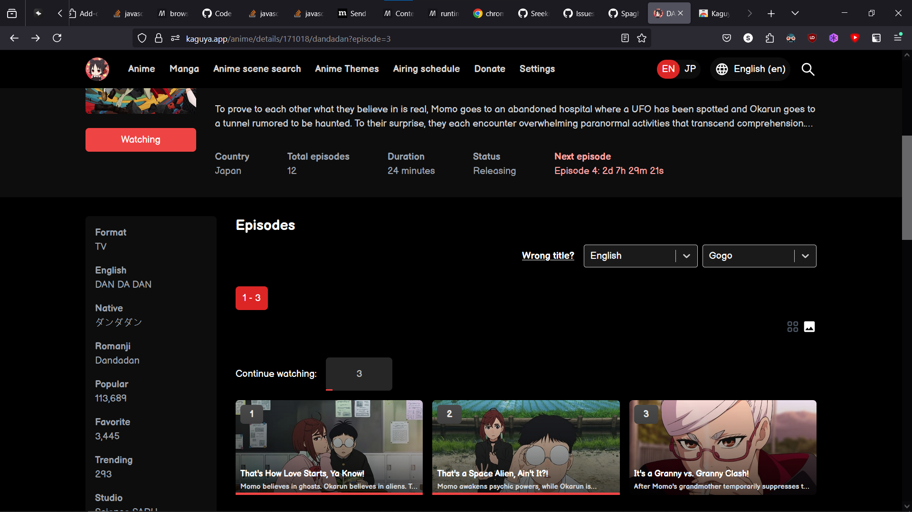

# Kaguya Firefox Extension

A port of the [Kaguya Chrome extension](https://chromewebstore.google.com/detail/kaguya/jhinkdokgbijplmedcpkjdbcmjgockgc) to Firefox.

Current source code is based on version 1.1.41.
Tested on Firefox Nightly 133.0a1 (2024-10-25).

## Installation

To install the extension:

1. Install the source code as a zip file
2. To install temporarily
   1. Go to [about:debugging#/runtime/this-firefox](about:debugging#/runtime/this-firefox)
   2. Click on "Add Temporary Add-on..."
   3. Select the installed zip file
3. Or permanently
   1. Go to [about:addons](about:addons)
   2. Click on the cog icon on the right of "Manage Your Extensions"
   3. Click on "Install Add-on From File..."
   4. Select the installed zip file
   5. (You might need to disable `xpinstall.signatures.required` in [about:config](about:config))

## Building

Before you begin, ensure you have the following prerequisites installed on your local machine:

- [Node.js](https://nodejs.org) (with npm)
- [Firefox](https://www.mozilla.org/en-CA/firefox/new)
- [web-ext](https://github.com/mozilla/web-ext)

Now to build the extension, follow these steps:

1. Clone this repository `git clone https://github.com/SpaghettDev/kaguya-extension-firefox`
2. Change directory to the cloned folder `cd kaguya-extension-firefox`
3. Install the necessary dependencies `npm install`
4. Then to build and pack the extension `npm run build-and-web-ext-pack`
5. Follow the steps in [Installation](#installation) to install the extension

have fun watching anime and reading manga
